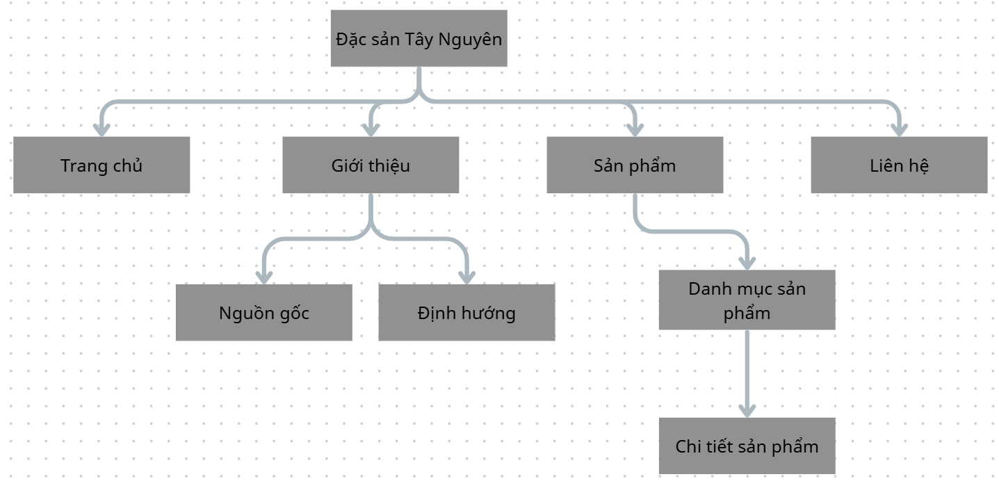

# 🌾 Website Giới Thiệu Đặc Sản Tây Nguyên

Là một trang web giới thiệu, bán các sản phẩm của khu vực Tây Nguyên. Mục đích quảng bá các đặc sản Tây Nguyên đến với tất cả mọi người.

---

## 📌 Tính năng chính

- **Trang chủ (Hero section):** Banner giới thiệu tổng quan với thông điệp về văn hóa Tây Nguyên.
- **Giới thiệu:** Thông tin chi tiết về thiên nhiên, văn hóa và các sản phẩm đặc trưng, nguồn gốc, mục tiêu của trang web.
- **Danh mục sản phẩm:** Các sản phẩm được chia thành nhiều danh mục, mỗi danh mục sẽ bao gồm các sản phẩm thuộc danh mục đó.
- **Form liên hệ:** Thông tin liên hệ.

## 📂 Cấu trúc thư mục

```text
dac-san-tay-nguyen/
│
├── index.html          # File giao diện chính
├── css
│   └── style.css       # File định dạng giao diện
├── js/                 # (Đang phát triển) Thư mục chứa các file xử lý logic
│    └── script.js
├── assets/             # Thư mục chứa các assets của trang web như hình ảnh, âm thanh, video.
├   ├── images
│   └── sounds
├── README.md           # Hướng dẫn dự án
└── package.json
```

## Sơ dồ kiến trúc hệ thống


## Hướng dẫn chạy dự án
Bước 1: Clone project về máy bằng lệnh :
```bash
git clone https://github.com/HuyTran271/Dac-San-Tay-Nguyen
```
Bước 2: Cài đặt extension Live Server trên Visual Studio Code (Nếu đã có bỏ qua bước này) <br>
Bước 3: Chuột phải vào file index.html <br>
Bước 4: Chọn Open With Live Server
